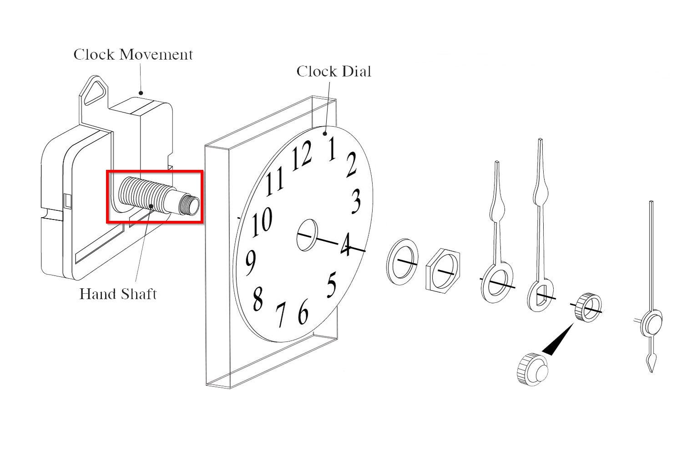
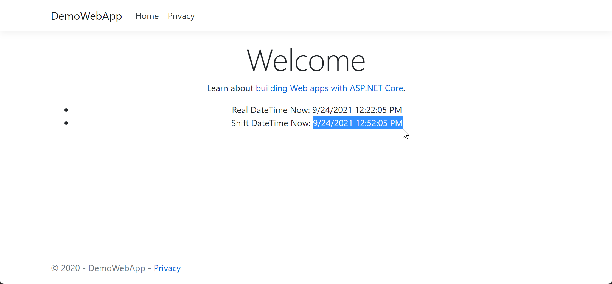

# GranDen Time-related testing library

## GranDen.TimeLib.ClockShaft

DateTime utility library for easier testing in unit test or integration test, naming by the shaft mechanical part of clock:

## GranDen.TimeLib.ClockShaft.Options

Library provides [ASP.NET Core Options pattern](https://docs.microsoft.com/en-us/aspnet/core/fundamentals/configuration/options) helper method and class for [GranDen.TimeLib.ClockShaft](https://www.nuget.org/packages/GranDen.TimeLib.ClockShaft/) library, see [test_sample](./test_sample) projects to see how to apply on ASP.NET Core Web and Generic Host project.

